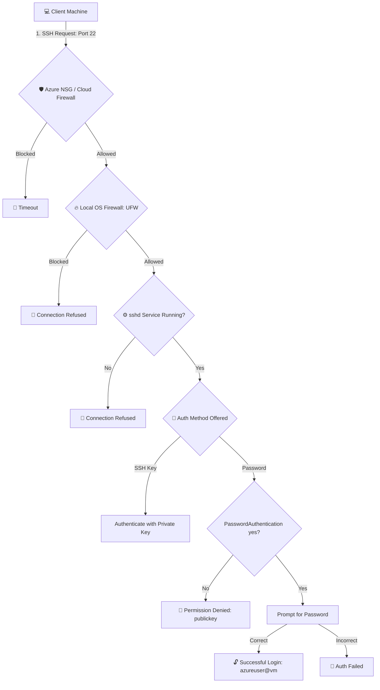

# Enable SSH Password Authentication on Ubuntu / Azure VM

This guide provides a comprehensive, step-by-step workflow to enable password-based SSH authentication on an Ubuntu or Azure Virtual Machine. It also includes security best practices, alternative automation methods, troubleshooting steps, and recovery options.

---

## SSH Connection & Authentication Flow

Below is the network and security pathway for SSH connections. Understanding this helps isolate issues at the firewall, service, or configuration level.



---

> [!WARNING]
> **Security Implication**: Enabling password authentication increases vulnerability to brute-force attacks. 
> * **Always** use a strong, complex password.
> * **Recommended**: Keep public-key authentication active and only use password authentication temporarily or alongside hardening tools like **Fail2ban**.

---

## Quick Reference: The Configuration Variables

To enable password authentication, we will modify the following settings:

| Directive | Default on Azure | Target Value | Description |
| :--- | :--- | :--- | :--- |
| `PasswordAuthentication` | `no` | `yes` | Allows logging in with the user's password. |
| `PubkeyAuthentication` | `yes` | `yes` | Keeps SSH key-based logins functional as a backup/primary option. |
| `PermitRootLogin` | `no` / `prohibit-password` | `no` | Disallows direct root password logins for safety. |

---

## 🛠️ Step-by-Step Implementation

### Step 1: Connect to Your VM (Using Your Existing Key)
First, connect to the server using the SSH private key you configured during VM deployment:
```bash
ssh -i /path/to/your-key.pem azureuser@YOUR_SERVER_IP
```

---

### Step 2: Set a Password for the User
Azure VMs do not set a default password for the admin user. You must assign one:
```bash
sudo passwd azureuser
```
*Expected Output:*
```text
New password: <type-your-strong-password>
Retype new password: <re-type-password>
passwd: password updated successfully
```

---

### Step 3: Update the SSH Daemon Configuration

You can update the SSH configuration using one of three methods depending on your needs.

#### Method A: Interactive (Using Nano)
Edit the primary configuration file:
```bash
sudo nano /etc/ssh/sshd_config
```
1. Scroll down to look for `PasswordAuthentication` (or add it at the bottom if not found).
2. Set or add the following lines:
   ```text
   PasswordAuthentication yes
   PubkeyAuthentication yes
   PermitRootLogin no
   ```
3. Save the file: Press `CTRL + O`, then `Enter`.
4. Exit the editor: Press `CTRL + X`.

#### Method B: Drop-in Configuration (Modern OS / Ubuntu 22.04+)
Instead of modifying the main config file, you can create a clean drop-in file. OpenSSH parses these files automatically:
```bash
echo -e "PasswordAuthentication yes\nPubkeyAuthentication yes\nPermitRootLogin no" | sudo tee /etc/ssh/sshd_config.d/60-password-auth.conf
```
> [!IMPORTANT]
> In OpenSSH, the *first* matching directive wins. If a file like `50-cloud-init.conf` exists in `/etc/ssh/sshd_config.d/` and sets `PasswordAuthentication no`, its setting may override yours. Check for existing files using:
> `ls /etc/ssh/sshd_config.d/`

#### Method C: Automated One-Liner (For Scripts)
If you want to automate this step without opening an editor:
```bash
sudo sed -i 's/^#\?PasswordAuthentication.*/PasswordAuthentication yes/' /etc/ssh/sshd_config
```

---

### Step 4: Verify SSH Syntax (Crucial Safety Step)
Before restarting the SSH daemon, verify that the configuration file is free of syntax errors. **Skipping this step can lock you out if there is a typo!**
```bash
sudo sshd -t
```
*If this command returns no output, your configuration is valid.*

---

### Step 5: Restart the SSH Service
Apply the new configuration changes:
```bash
sudo systemctl restart ssh
```

---

### Step 6: Verify Service Status
Ensure the service is up and running successfully:
```bash
sudo systemctl status ssh
```
*Expected Output:*
```text
● ssh.service - OpenSSH server daemon
   Active: active (running) since Sun 2026-07-12...
```
*(Press `Q` to exit the status screen).*

---

### Step 7: Allow SSH Port in Firewall (UFW)
If UFW (Uncomplicated Firewall) is enabled on your VM, make sure Port 22 is allowed:
```bash
# Check UFW Status
sudo ufw status

# Allow Port 22 (SSH)
sudo ufw allow 22/tcp

# Reload to apply
sudo ufw reload
```

---

### Step 8: Test SSH Login from Your Local Machine
Open a new terminal window on your local machine (PowerShell or CMD) and test password authentication. **Do not close your current active SSH session until you verify you can log in.**

```cmd
ssh azureuser@YOUR_SERVER_IP
```
*Expected prompt:*
```text
azureuser@YOUR_SERVER_IP's password: <enter-your-password>
azureuser@yourvm:~$
```

---

## Troubleshooting & Diagnostics

### 1. Connection Timeout
If the connection hangs, the request is not reaching your VM.
* **Azure Network Security Group (NSG):** Verify that the NSG associated with the VM's Network Interface or Subnet has an **Inbound Security Rule** allowing Port `22` from your IP or `Any` source.
  
  | Priority | Name | Port | Protocol | Source | Destination | Action |
  | :--- | :--- | :--- | :--- | :--- | :--- | :--- |
  | 1000 | AllowSSHInbound | 22 | TCP | Any / My IP | Any | Allow |

### 2. Permission Denied (publickey)
If you get `Permission denied (publickey)`, the SSH daemon rejected password auth.
* Validate that `PasswordAuthentication` is set to `yes` and is not overridden.
* Run a quick test query:
  ```bash
  sudo sshd -T | grep -i passwordauthentication
  ```
  *Expected Output:* `passwordauthentication yes` (If it says `no`, the setting was overridden or not reloaded).

### 3. Check System Logs
If the connection is rejected instantly, inspect the authentication logs for details:
```bash
# View last 50 lines of SSH service logs
sudo journalctl -u ssh -n 50 --no-pager

# Tail the auth log in real-time
sudo tail -f /var/log/auth.log
```

---

## Best Practice: Install Fail2ban (Recommended)
Because passwords can be brute-forced, it is highly recommended to install Fail2ban, which bans IPs showing malicious authentication behavior:
```bash
sudo apt update
sudo apt install fail2ban -y
sudo systemctl enable fail2ban
sudo systemctl start fail2ban
```
By default, Fail2ban protects SSH and bans offenders for 10 minutes after 5 failed attempts.

---

## Emergency Recovery (If Locked Out)

If you get locked out of your Azure VM:
1. Go to the **Azure Portal**.
2. Select your Virtual Machine.
3. Under the **Help** / **Operations** section on the left menu, search for **Reset password**.
4. Set the mode to **Reset SSH public key** or **Reset password**.
5. Input `azureuser` and your new credentials, then click **Update**.
6. Alternatively, use **Serial Console** to log in locally and fix the SSH configuration file.
